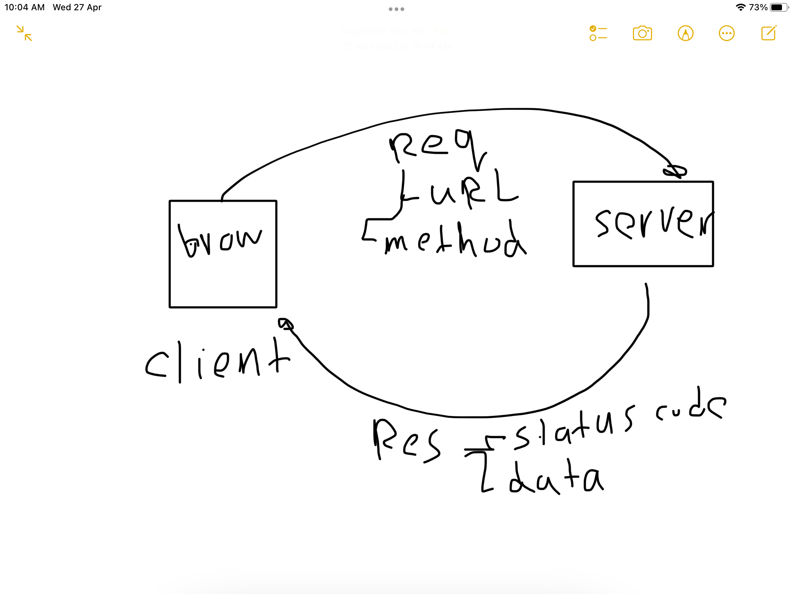
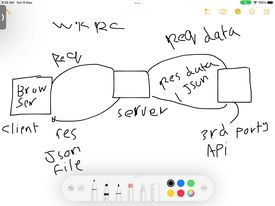
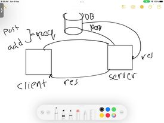

# Mpvie Library - 1.0.0

**Author Name**: Saleh ziad
# TASK 11
## WRRC

### answers
1-it take 1 day.
2-no questions.
# TASK 12
## WRRC

### answers
1-it take 3 day.
2-no questions.
# TASK 13
## WRRC

### answers
1-it take 5h day.
2-no questions.
# TASK 13
### answers
1-it take 5h day.
2-no questions.
## Overview
-this project contain all the  data about fielms. 
-you can add any fielm you want by specific info.
-you can search on any fielm in api or from added fielms
## Getting Started
to run this project you need to run server and start making full crud
## Project Features
it will be fueature wap app to make full crud about fielms